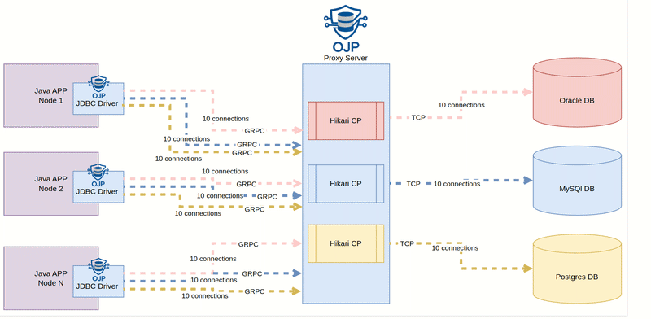

# Open JDBC Proxy

A JDBC Driver and Layer 7 Proxy Server to decouple applications from relational database connection management.

**Status: Alpha version in development** - Not recommended for production use

[](https://buymeacoffee.com/wqoejbve8z)

## Value Proposition

OJP enables elastic scaling of applications without overwhelming databases with connection overhead. Replace your native JDBC drivers with minimal configuration changes while gaining intelligent connection pooling, multi-database support, and seamless scalability - perfect for microservices, serverless, and event-driven architectures.

## Questions we aim to answer:
#### How to autoscale our applications without overloading our relational database(s) with new connections?
#### How to replace native JDBC drivers seamlessly?
#### How to support multiple relational databases at once?

## Quick Start

Get OJP running in under 5 minutes:

### 1. Start OJP Server
```bash
docker run --rm -d -p 1059:1059 rrobetti/ojp:0.0.4-alpha
```

### 2. Add OJP JDBC Driver to your project
```xml
<dependency>
    <groupId>org.openjdbcproxy</groupId>
    <artifactId>ojp-jdbc-driver</artifactId>
    <version>0.0.4-alpha</version>
</dependency>
```

### 3. Update your JDBC URL
Replace your existing connection URL by prefixing with `ojp[host:port]_`:

```java
// Before (PostgreSQL example)
"jdbc:postgresql://user@localhost/mydb"

// After  
"jdbc:ojp[localhost:1059]_postgresql://user@localhost/mydb"

// Oracle example
"jdbc:ojp[localhost:1059]_oracle:thin:@localhost:1521/XEPDB1"

// SQL Server example
"jdbc:ojp[localhost:1059]_sqlserver://localhost:1433;databaseName=mydb"
```
Use the ojp driver: `org.openjdbcproxy.jdbc.Driver`

That's it! Your application now uses intelligent connection pooling through OJP.

## Documentation

- [Architectural decision records (ADRs)](documents/ADRs) - Technical decisions and rationale behind OJP's architecture.
- [Get started: Spring Boot, Quarkus and Micronaut](documents/java-frameworks) - Framework-specific integration guides and examples.
- [Connection Pool Configuration](documents/configuration/CONNECTION_POOL_CONFIG.md) - OJP connection pool settings and tuning parameters.
- [OJP Server Configuration](documents/configuration/ojp-server-configuration.md) - Server startup options and runtime configuration.
- [Telemetry and Observability](documents/telemetry/README.md) - OpenTelemetry integration and monitoring setup.

## High Level Design




* The OJP JDBC driver is used as a replacement for the native JDBC driver(s) previously used with minimal change, the only change required being prefixing the connection URL with `ojp_`. For example:
* **Open Source**: OJP is an open-source project that is free to use, modify, and distribute.
* The OJP server is deployed as an independent service that serves as a smart proxy between the application(s) and their respective relational database(s), controlling the number of connections open against each database.
* **Smart Connection Management**: The proxy ensures that database connections are allocated only when needed, improving scalability and resource utilization.
* **Elastic Scalability**: OJP allows client applications to scale elastically without increasing the pressure on the database.
* **gRPC Protocol** is used to facilitate the connection between the OJP JDBC Driver and the OJP Server, allowing for efficient data transmission over a multiplexed channel.
* OJP Server uses **HikariCP** connection pools to efficiently manage connections.
* OJP supports **multiple relational databases** - in theory it can support any relational database that provides a JDBC driver implementation.
* OJP simple setup just requires the OJP library in the classpath and the OJP prefix added to the connection URL (e.g., `jdbc:ojp[host:port]_h2:~/test` where `host:port` represents the location of the OJP server).
 
## Vision
Provide a free and open-source solution for a relational database-agnostic proxy connection pool. The project is designed to help efficiently manage database connections in microservices, event-driven architectures, or serverless environments while maintaining high scalability and performance.

## Target problem
In modern architectures, such as microservices, event-driven systems, or serverless (Lambda) architectures, a common issue arises in managing the number of open connections to relational databases. When applications need to elastically scale, they often maintain too many database connections. These connections can be held for longer than necessary, locking resources and making scalability difficult. In some cases, this can lead to excessive resource consumption, placing immense pressure on the database. In extreme scenarios, this can even result in database outages.

## The solution
OJP provides a smart proxy to solve this problem by dynamically managing database connections. Rather than keeping connections open continuously, OJP only allocates real database connections when an operation is performed. The proxy ensures that resources are used efficiently by allocating connections only when truly necessary. For example, a real connection to the database is established only when an actual operation (e.g., a query or update) is performed, thus optimizing resource usage and ensuring better scalability.
This intelligent allocation of connections helps prevent overloading databases and ensures that the number of open connections remains efficient, even during heavy elastic scaling of applications.

## Components

### ojp-server
The ojp-server is a gRPC server that manages a HikariCP connection pool and abstracts the creation and management of database connections. It supports one or multiple relational databases and provides virtual connections to the ojp-jdbc-driver. The server ensures the number of open real connections is always under control, according to predefined settings, improving database scalability.

### ojp-jdbc-driver
The ojp-jdbc-driver is an implementation of the JDBC specification. It connects to the ojp-server via the gRPC protocol, sending SQL statements to be executed against the database and reading the responses. The driver works with virtual connections provided by the ojp-server, allowing the application to interact with the database without directly managing real database connections.

Latest version:

         <dependency>
             <groupId>org.openjdbcproxy</groupId>
             <artifactId>ojp-jdbc-driver</artifactId>
             <version>0.0.4-alpha</version>
         </dependency>


#### Important: Disable your application's connection pool

When using OJP, disable any existing connection pooling in your application (such as HikariCP, C3P0, or DBCP2) since OJP handles connection pooling at the proxy level. This prevents double-pooling and ensures optimal performance.

**Important**: OJP will not work properly if another connection pool is enabled on the application side. Make sure to disable all application-level connection pooling before using OJP.

### ojp-grpc-commons
The ojp-grpc-commons module contains the shared gRPC contracts used between the ojp-server and ojp-jdbc-driver. These contracts define the communication protocol and structure for requests and responses exchanged between the server and the driver.

## Contributing & Developer Guide

Welcome to OJP! We appreciate your interest in contributing. This guide will help you get started with development.

### Prerequisites
- Java 17 or higher
- Maven 3.9+
- Docker (for running databases and OJP server)

### Getting Started

1. **Clone the repository**
   ```bash
   git clone https://github.com/Open-JDBC-Proxy/ojp.git
   cd ojp
   ```

2. **Build the project**
   ```bash
   mvn clean install -DskipTests
   ```

3. **Start OJP server** (required for running tests)
   ```bash
   mvn verify -pl ojp-server -Prun-ojp-server
   ```

4. **Run integration tests**
   Navigate to the ojp-jdbc-driver folder first:
   ```bash
   cd ojp-jdbc-driver
   mvn test -DdisablePostgresTests -DdisableMySQLTests -DdisableMariaDBTests
   ```
**Note:** With the disable flags only H2 integration tests will run, to run the full set of integration tests you have to run all the databases locally, follow the instructions at [Run Local Databases](documents/environment-setup/run-local-databases.md)

### Databases with integration tests
We have comprehensive JDBC integration tests with OJP for the following databases:
- Postgres
- MariaDB
- MySQL
- Oracle
- SQL Server
- H2

The free and open source databases (H2, Postgres, MySQL and MariaDB) jdbc drivers are packed with OJP and have integration tests always running in our CI pipelines, for proprietary databases as Oracle and SQL Server see specific sections.

### Oracle Database Setup (Optional)
Oracle integration tests require the Oracle JDBC driver and due to licensing restrictions we do not pack it with OJP.
For detailed Oracle setup instructions, see [Oracle Testing Guide](documents/environment-setup/oracle-testing-guide.md).

### SQL Server Database Setup (Optional)
SQL Server integration tests use the Microsoft SQL Server JDBC driver which is not included in OJP dependencies.
For detailed SQL Server setup instructions, see [SQL Server Testing Guide](documents/environment-setup/sqlserver-testing-guide.md).

### Testing Configuration
- Test connection configurations are stored in CSV files under `test/resources`
- File naming indicates supported databases (e.g., `h2_postgres_connections.csv` supports H2 and PostgreSQL)
- Integration tests run against each configured connection
- See [run-local-databases.md](documents/environment-setup/run-local-databases.md) for local database setup

### Test Options
- `-DdisablePostgresTests` - Skip PostgreSQL integration tests
- `-DenableOracleTests` - Enable Oracle integration tests (disabled by default, requires manual Oracle JDBC driver setup)
- `-DenableSqlServerTests` - Enable SQL Server integration tests (disabled by default)

### Contributing
1. Fork the repository
2. Create a feature branch
3. Make your changes with tests
4. Ensure all tests pass
5. Submit a pull request

For questions or support, please open an issue on GitHub.

## Partners
<a href=https://www.linkedin.com/in/devsjava/>

</a>
<a href=https://github.com/switcherapi>

</a>
